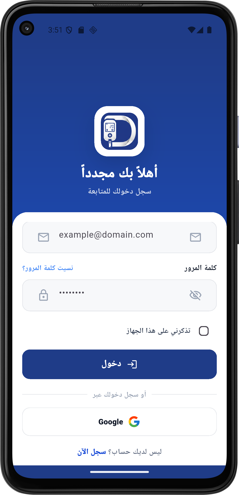
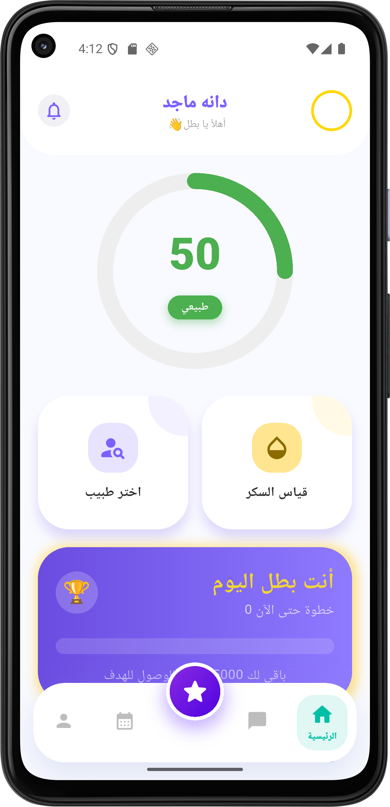
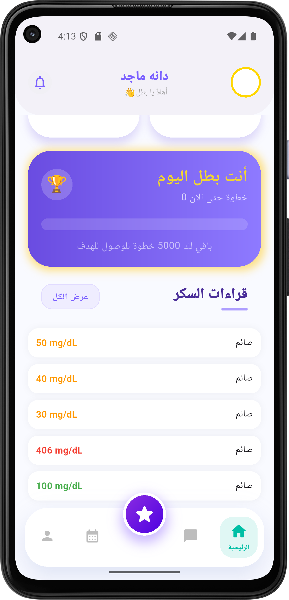
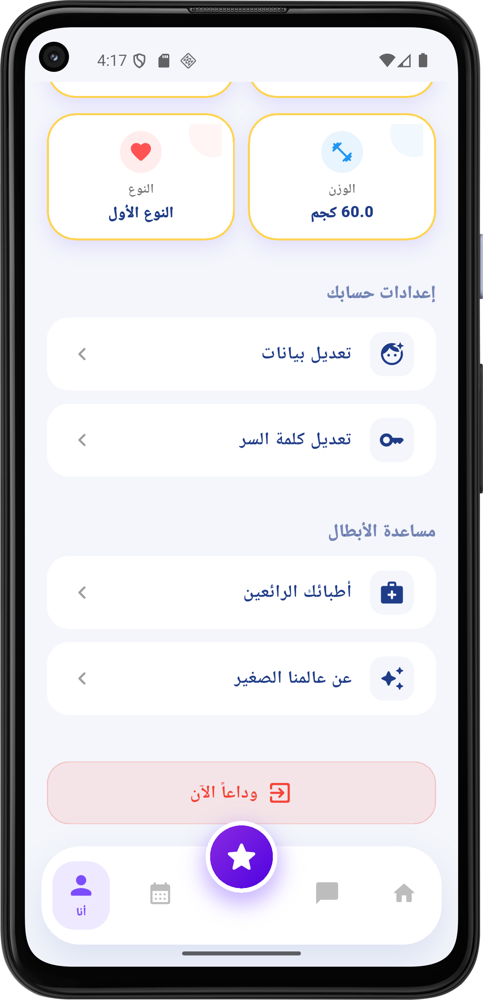
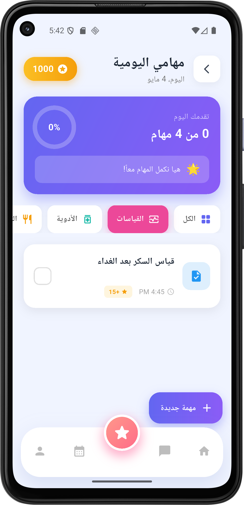
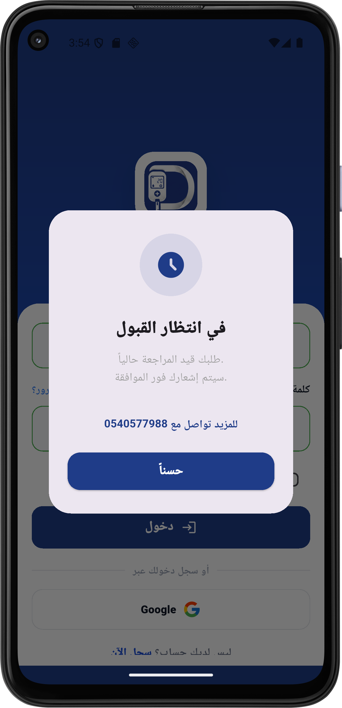

# DiaSugar – Smart Diabetes Management Application

DiaSugar is an intelligent mobile application developed using Flutter and Firebase to support diabetes management through real-time monitoring, communication, and personalized healthcare features.

---

# Project Poster

[View Full Poster PDF](Poster.pdf)

---

# Features

* Multi-role system (Doctor, Adult Patient, Child Patient, Admin)
* Real-time glucose monitoring
* Smart alerts and notifications
* Doctor-patient communication
* Appointment scheduling and management
* Child-friendly interactive experience
* Task and goal tracking
* Firebase real-time synchronization
* Admin dashboard and analytics

---

# Technologies Used

* Flutter
* Firebase Authentication
* Cloud Firestore
* Dart
* Firebase Cloud Messaging
* fl_chart

---

# Login & Registration

  
  
  

---

# Doctor Interface

  
  
  

  
  
  

  
  
  

  
  

---

# Adult Patient Interface

  
  
  

  
  
  

  
  
  

  
  
  

  

---

# Child Interface

  
  
  

  
  
  

  
  
  

  
  

---

# Admin Dashboard

  
  
  

  

---

# Interactive Task System

  
  

---

# Project Overview

The application was developed as a graduation project at Jazan University to improve diabetes management through smart healthcare technologies and user-friendly design.

DiaSugar focuses on delivering continuous care, real-time monitoring, and improved communication between patients and healthcare providers.
